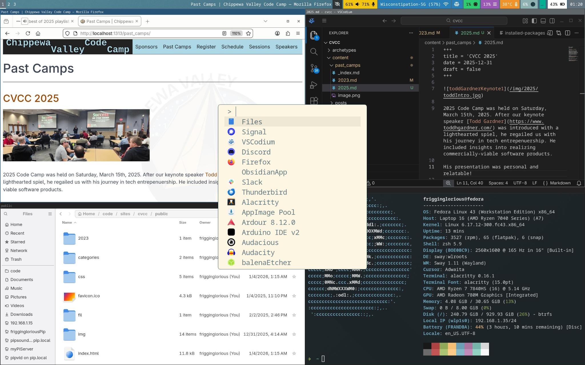

# dotfiles

On my Framework 16 laptop on Fedora 43, these are my configuration files for Sway tiling window manager (with Waybar), Alacritty for terminal, with zsh and oh-my-zsh for config settings.

Config for sway goes in ~/.config/sway/config

includes swapping ctrl / alt keys for mac-friendly, and waybar

  349  sudo dnf install @sway-desktop-environment
  359  sudo dnf install waybar
  442  sudo dnf install alacritty
sudo dnf install fuzzel
sudo dnf install fastfetch

sh -c "$(curl -fsSL https://raw.githubusercontent.com/ohmyzsh/ohmyzsh/master/tools/install.sh)"

